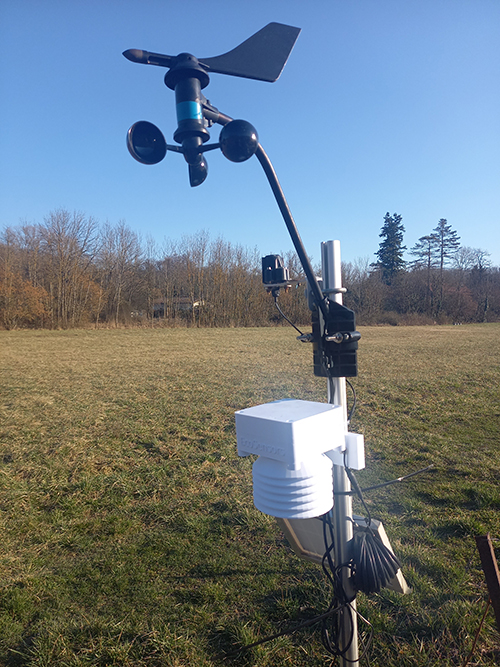

# EcoAnemo

The library is actually under developpement

Arduino library for the DEVIS anenomter and wind direction sensors is distributed WITHOUT WARRANTY.
The library has been tested for the ATSAMD21G18 ARM Cortex M0 at 48Mhz board with 3V3 logic.

Sensor reference: 6410 | [Documentation](assets/07395-277_IM_6410.pdf) | [Spec sheet](assets/6410_SS.pdf)

## Wiring

Wire | I/O
--- | ---
Green | Wind direction input (A1) 
Yellow | 3.3V
Black | Wind speed input (A0). Add a 4.7K (?? 20K ??)to the VCC
Red | GND

Wind Direction Translation: Variable resistance 0 - 20KΩ; 10KΩ = south, 180°

Wind Speed Translation Formula: 1600 rev/hr = 1 mph
V = P(2.25/T) (V = speed in mph, P = no. of pulses per sample period, T = sample period in seconds)

## How to use it
Connect the Davis Anemometer to your board

### Calibration
You should better make sure that the analog values returned by the vane (Wind direction) match to the cardinal directions. For that purpose, open the example file named calibration.ino and process to the following steps

1. Make sure that the variable [WindDirectionOffset](https://github.com/ecosensors/EcoAnemo/blob/main/EcoAnemo.h#L18) is with the value 0
2. Turn the vane at the same direction than the arm (metal point in the front)
3. turn the vane and at each 45°, write down the analog values to the array [WDdirection](https://github.com/ecosensors/EcoAnemo/blob/main/EcoAnemo.h#L24)

Analog value | Degre (Direction)
--- | ---
...	| 0° (N)
... | 45° (NE)
...	| 90° (E)
... | 135° (SE)
... | 180° (S)
... | 225° (SW)
... | 270° (W)
... | 315° (NW)
... | 360° (N)

### Offset
Fix the anemometer and orient the arm to the North. In that case, the variable 'WindDirectionOffset' must be egal to 0.
If the arm is not oriented to the north, you have to modify 'WindDirectionOffset' in EcoAneno.h to. Expl: If the arm is oriented to the Est, the 'WindDirectionOffset' has to be changed to 90.

### Contribute
Test it and feel free to improve it.

## Version
[26.2.2023] v.1

## License
[![CC BY-NC-SA 4.0][cc-by-nc-sa-shield]][cc-by-nc-sa]

This work is licensed under a
[Creative Commons Attribution-NonCommercial-ShareAlike 4.0 International License][cc-by-nc-sa].

[![CC BY-NC-SA 4.0][cc-by-nc-sa-image]][cc-by-nc-sa]

[cc-by-nc-sa]: http://creativecommons.org/licenses/by-nc-sa/4.0/
[cc-by-nc-sa-image]: https://licensebuttons.net/l/by-nc-sa/4.0/88x31.png
[cc-by-nc-sa-shield]: https://img.shields.io/badge/License-CC%20BY--NC--SA%204.0-lightgrey.svg
